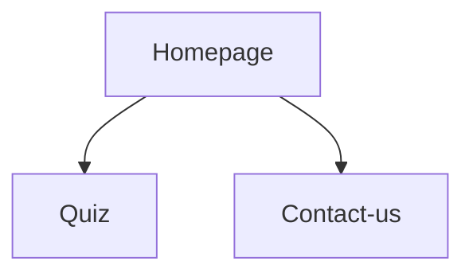
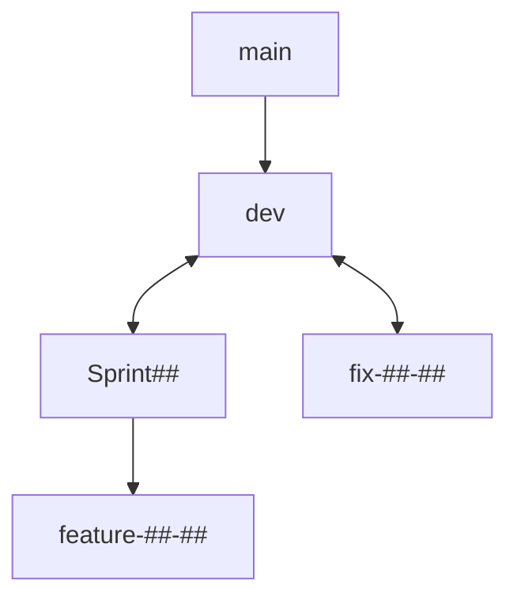

# Projet 2 :"QuizVerse - Quiz about the universe"

## Team

Number of participants : 5

- Victoire
- Yohann
- Mathieu
- Sébastien
- Valentin

## Pitch

For a project at the Wild Code School, we had to develop in group an application in React that would allow us to use an API. We chose to develop a quiz on the theme of the universe. The application is responsive.

## Site structuring



### Homepage

The homepage includes a header allowing direct access to the quiz, a table displaying the last 5 participations of the players in the "easy" and "difficult" category, a description of the project and a footer.
Our work also focused on setting up a footer with a burger menu and a footer including the (fictitious) social networks of our project.

### Quiz

The quiz was designed using our own API (https://api.quizverse.space) that we created as part of the project. Two levels are possible, easy and hard, with 10 questions in each level with 4 answers to each question.
A toastify alert allows to bring additional elements to the right or wrong answer of the player. Finally, at the end of the quiz, the player has the possibility to leave his name so that his participation can be displayed in the Homepage.

### Contact-us

We have developed a contact page allowing the player or visitor to send us an email. This page has been created with the Emailjs library. Each message is sent to our email address.

## Project development

We validated the first wireframes in 3 steps (paper / Figma) with the client.

The format of the site will be necessary for mobile screens (480px) and desktop screens (1024px)

## GitHub repository

We have created a folder on GitHub that is structured like this:



## Presentation

The site will be presented several times during intermediaires presentations and will be presented to our entire graduating class on Wednesday, November 23, 2022.

## Setup

To run this project, install it locally using npm: (only front folder is necessary)

```bash
npm run setup
npm run dev-front
```
